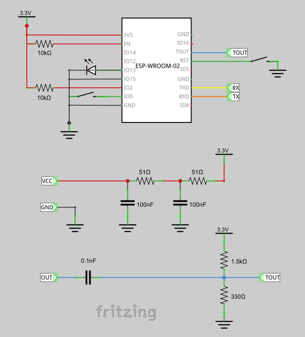
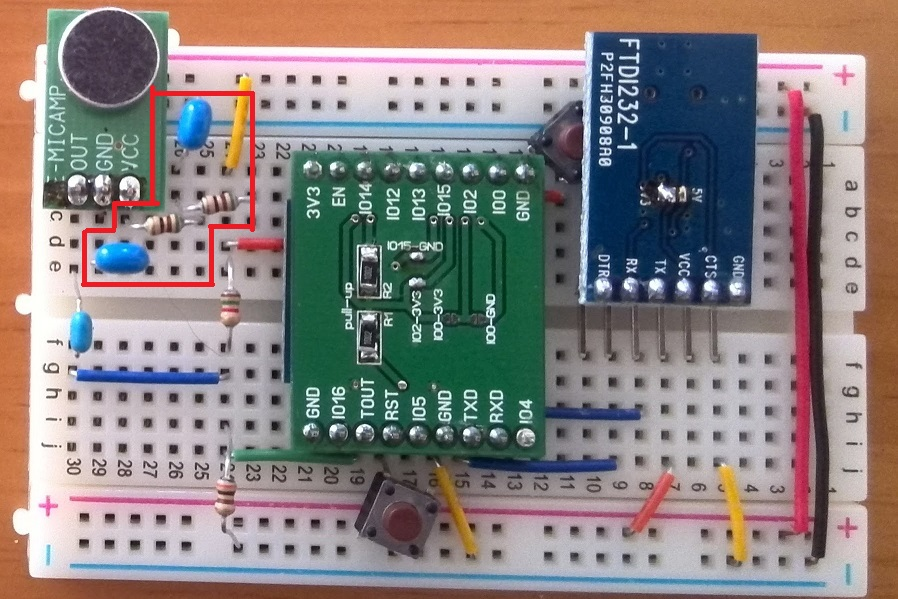

ESP8266とコンデンサマイクを接続してAnalogReadで録音してBluemixで音声認識させてデバイスを制御する
# 0. そもそもの発端
Codezineに「[mbedを使って音声認識でデバイスを制御する](http://codezine.jp/article/detail/9568)」という記事があり、手元にあった[NUCLEO-F401RE](http://www.st.com/content/st_com/ja/products/evaluation-tools/product-evaluation-tools/mcu-eval-tools/stm32-mcu-eval-tools/stm32-mcu-nucleo/nucleo-f401re.html)でやってみようと思ったのですが、とある「ぬいぐるみ」の体内に収めるには大きかったので、遅い夏休みの宿題として、安く小さくできないかとチャレンジしてみました。
結果、ESP8266、マイクアンプキット、少々の回路と電源があれば、録音してBluemixで音声認識して結果を処理する、ということが実現できそうなことがわかりました。ぬいぐるみの体内にも十分収まりそうな見込みです。

# 1. はじめに

本記事では秋月の[高感度マイクアンプキット](http://akizukidenshi.com/catalog/g/gK-05757/)を使いESP-WROOM-02で音声を集音する方法を紹介します。
以下の内容について触れます:

1. コンデンサマイクとESP8266との接続
 1. 電源ノイズをRCフィルタで低減させる
 2. 入力にバイアスを載せる
2. 音声データを取得する
 1. アナログピン入力をA/D変換
 2. 割り込みを使ったサンプリング
 3. ダブルバッファリング(SRAM)
 4. バッファのFlashへの吐き出し
3. 音声データをWifi経由でGET/POST
 1. Wifiをステーションモードで接続する
 2. Webサーバを立ててファイルをダウンロードさせる
 3. HTTPSクライアントとしてBluemixにPOSTリクエストを投げる

今回は16bit 8kHz PCM フォーマットで5秒程度の音声データを収録することができました。収録秒数はこのあとの音声認識に投げる都合によるものです。
またデータの取得と外部への送信は同時にはできません。(現在チャレンジ中)

コンデンサマイクの出力をA/D変換で取り込むのでデリケートです。デジタルマイクを使った記事「[ESP8266とデジタルマイクADMP441を接続(Arduino SPIライブラリ版)](http://qiita.com/masato_ka/items/59067c9619049219bf68)」も参考になるでしょう。
なお本記事は電子回路の知識が必要です。実施は各人の責任でお願いいたします。

# 2. 利用方法の検討

## 2.1 秋月[高感度マイクアンプキット](http://akizukidenshi.com/catalog/g/gK-05757/) の概要

高感度マイクアンプキットは、コンデンサマイクとオペアンプを収めたアナログマイクモジュールです。コンデンサマイクの出力は極小程度ですが、そのすぐ近くにオペアンプを配置して100倍に増幅することで外来ノイズの影響を受けにくくなります。オペアンプ[OPA344](http://www.tij.co.jp/product/jp/OPA344)はレールツーレールというタイプで、ほぼ電源電圧まで増幅できるものです。3.3Vで駆動し、3.3VのArduinoで10bitにA/D変換してみたところ、±400くらいの振幅がとれました。振幅が大きすぎれば[帰還抵抗を調整して増幅率を下げて](http://s.webry.info/sp/sfukuda.at.webry.info/201206/article_20.html)やればよさそうです。

## 2.2 ESP8266のA/D変換機能

ESP8266はTOUTピンがA0として動作し、入力された0～1Vを10bitの分解能で取得できます。マイクからの入力信号の振幅を1Vの範囲に収め、0.5V程度を中心としてかさ上げしてやればよさそうです。

## 2.3 ESP8266のOS

ESP8266には実行タイミングを細かく調整できるリアルタイムOS(RTOS)用のSDK[^RTOS]と、Non-OS用のSDKが用意されていますが、今回は利用者が多そうな[ESP8266用Arduinoライブラリ](https://github.com/esp8266/Arduino)は[2.3.0](https://github.com/esp8266/Arduino/releases/tag/2.3.0)を使います。
開発環境を作るには、[技適済み格安高性能Wi-FiモジュールESP8266をArduinoIDEを使ってIoT開発する為の環境準備を10分でやる方法](http://qiita.com/azusa9/items/264165005aefaa3e8d7d)が参考になります。

[^RTOS]: RTOSで開発するなら [ESP8266(ESP-WROOM-02)のリアルタイムOS開発環境の構築](http://qiita.com/Minaki1018/items/dd89dd352a853def5f10)が参考になるでしょう。

# 3. ESP8266との接続

マイクアンプキットからの3本の線を、それぞれ以下のようにつなぎます。

| マイク |  | ESP8266 |
|---:|:-:|:---|
|GND|そのまま|GND|
|VCC|RCフィルタ経由で|3V3|
|OUT|コンデンサを挟み、バイアスを載せて|TOUT|

回路図はこんな感じになりました[^Freizing]。バイアスはCodezineの記事だと安定化後のVCCからとっていますが、ためしに3V3からとってみました。試行錯誤中です。
おっと、LEDの電流制限抵抗が抜けてます。適切な抵抗を挟むかハイインピーダンスなLEDを使ってください。





* ESP8266(ESP-WROOM-02)は中央の緑の基板の裏側に貼り付けている。
* ブレークアウト基板は[aitendo](http://www.aitendo.com/)の[WiFiモジュール変換基板(J-A)](http://www.aitendo.com/product/12120)。基板上の左半分にあるチップ抵抗は1206サイズの10kΩ×2で、RSTとENをプルアップしている。中央の2か所にあるIO15-GNDとIO2-3V3ははんだでブリッジさせている。残りのIO0-3V3とIO0-GNDは開放のまま。
* 右上の橙色は基板裏でIO0につながっていて、これを押してGNDに落としながらリセットすることでUART DownLoad Modeで起動する。
* 基板左上の橙色は基板裏で3V3につながっている。
* 左側の赤枠内が、RCフィルタ回路。VCCのノイズを取るためのもの。
* 左側の赤枠外が、マイク入力から交流成分を取り出して 0.5vバイアスに載せる回路。緑色がTOUTつまりAnalog0ピンに入っている。
* 中央下は、茶色のスイッチはリセットスイッチ。黄色がGND。
* そのすぐ右はTXDからRXへ。基板裏でRXDからTXへ接続している。右上の青い基板は[USBシリアル](http://www.aitendo.com/product/7396)。基板中央は5Vのパターンをカットして3V3側にブリッジした。ここからUSBケーブルでPCにつないでいる。この回路はモニタ用なので、将来は不要になる部分。**注意 この構成だとアップロードに失敗します。∵[VIOが3V3でなくVCCに繋がっている](http://www.garitto.com/product/24443159#review)ため** いいと思ったんだけどな
* 茶色のスイッチはもともと4本足だけど、そのまま+-に接続できるように、足2本はニッパで切断している。
* 回路図にあるLEDは外した。理由は後述

[^Freizing]: 部品データは以下を使用させていただきました:　http://tomoto335.hatenablog.com/entry/esp-wroom-02/14

# 4. プログラム

## 4.1 作りたいデータ

本記事でもCodezineの記事にならい、16bit,8kHz,monoの無圧縮 wavファイルを作ることをゴールにしようと思います。つまり、RIFFヘッダに続けて、125μsecおきにサンプリングした16bitデータをだらだらと並べた形式です。各サンプル値は0を中心とした符号付き16bit値です。

## 4.2 サンプル値の取得方法

analogRead(A0)は0～1023の値を返すので、最初に何回かanalogRead(A0)して平均を計算しておき、そこをゼロポイントとみなします。
録音時、各サンプル値からゼロポイント値を引くことで、0を中心とした符号付き整数を作ることにします。格納先はSRAM上にバッファ領域を用意して格納することにします。バッファ0とバッファ1の二つを用意し、一杯になったら切り替えて交互に格納することにします。
計算の高速化をねらい、バッファサイズは2進数で切りのいいサイズにしておきます。こうすることで、カウンタ変数の特定のbitがバッファ0/1のどちらを使うかを意味し、それより下位のbitがバッファ内の位置を示すようになります[^bufsize]。

[^bufsize]: いろいろ計算してるけど、もしかして、2つのバッファは繋がってて、いろいろ計算する部分はまるっと最適化で消え去っているような気がする。たぶん。

```cpp
// 格納先
#define BUFBIT 12
#define BUFSIZE (1<<BUFBIT)
#define BUFMASK (BUFSIZE-1)

int16_t buffer[2][BUFSIZE];
int adc_bias;
long toggle_counts;
long counter = 0;

// ゼロポイントの測定
void void init_adc_bias() {
  for (int i = 0; i < 1 << 8; i++) {
    adc_bias += analogRead(A0);
    os_delay(1);
  }
  adc_bias >>= 8;
}

// サンプル値の取得
void sampling() {
  uint16_t sensorValue = analogRead(A0) - adc_bias;
  buffer[(counter >> BUFBIT) & 1][counter & BUFMASK] = sensorValue;
  counter++;
  if (counter > toggle_counts) {
    stop_sampling();
  }
}

```

## 4.3 サンプリング処理の呼び出し方法
さて、125μsecおきにサンプリング処理を呼び出す方法について考えます。「(A) サンプルを採取して125μsecウェイト、をループで繰り返す」「(B) 125μsecおきに割り込み、サンプルを採取」。ループだと録音だけしかできなくなってしまいますが、ほかにもやりたい処理があるので、本記事では割り込みでやってみることにします。[Tone.cpp#L80]
ESP8266+Arduinoでの割り込み方法はいくつかありますが、[(**TODO:別記事を書く**)]()によれば、timer1を使う方式が適しています。(https://github.com/esp8266/Arduino/blob/master/cores/esp8266/Tone.cpp#L80) を参考に、こんな感じで:

```cpp
// frequency (in hertz) and duration (in milliseconds).
void start_sampling(unsigned int frequency, unsigned long duration) {
  toggle_counts = frequency * (duration / 1000);
  timer1_disable();
  timer1_isr_init();
  timer1_attachInterrupt(sampling);
  timer1_enable(TIM_DIV1, TIM_EDGE, TIM_LOOP);
  timer1_write((clockCyclesPerMicrosecond() * 1000000) / frequency);
}

void stop_sampling() {
  timer1_disable();
  timer1_detachInterrupt();
}

void setup() {
  start_sampling(FREQUENCY, DURATION);
}
```

## 4.4 バッファを吐き出す

RAM上にバッファを二つ用意して交互に使うことにしましたが、これだけでは両方のバッファがいっぱいになったあと、古いデータをどんどん書き潰してしまいます。そこで、sample関数においてバッファが一杯になったらフラグを倒し、別関数でフラグが倒れていたら一杯になったバッファをFlashにコピーする、のように処理することにします。
外部からも観測したいので、D13をフラグに使います。

```cpp
#include <FS.h>
#include <Ticker.h>
#define INDICATORPIN 13

File fd;
Ticker bufferWriter;

ICACHE_RAM_ATTR void sampling() {
  // 末尾に以下を追加する:
  if ((counter & BUFMASK) == 0) { // overflow
    digitalWrite(INDICATORPIN, LOW);
  }
}

void flush_buffer() {
  if (digitalRead(INDICATORPIN) == HIGH) return;  // do nothing if
  fd.write((uint8_t*)buffer[1 - (counter >> BUFBIT) & 1], 1 << (BUFBIT + 1));
  digitalWrite(INDICATORPIN, HIGH);
}

void start_sampling(unsigned int frequency, unsigned long duration) {
  // 先頭に以下を追加する:
  SPIFFS.format();  // 書き込み速度のムラをなくす
  fd = SPIFFS.open("/sample.wav", "w");
  writeRiffHeader(&fd);
  pinMode(INDICATORPIN, OUTPUT);
  digitalWrite(INDICATORPIN, HIGH);
  bufferWriter.attach(0.02, flush_buffer);
}

void stop_sampling() {
  // 末尾に以下を追加する:
  bufferWriter.detach();
  flush_buffer();  // 最後の一つ前のバッファを吐き出す
  fd.write((uint8_t*)buffer[(counter >> BUFBIT) & 1], (counter & BUFMASK) * 2 - 2);  // 最後まで吐き出す
  fd.close();
}

void setup() {
  // 先頭に以下を追加する:
  SPIFFS.begin();
}
```

## 4.5 WAVヘッダを作る

最初にファイルを用意するようにしたので、このタイミングでWAVファイルのヘッダを生成してしまいます。[getUserMediaで録音したデータをWAVファイルとして保存する](http://qiita.com/HirokiTanaka/items/56f80844f9a32020ee3b#2-wav%E3%83%95%E3%82%A1%E3%82%A4%E3%83%AB%E3%81%AB%E5%A4%89%E6%8F%9B%E3%81%99%E3%82%8B) を参考にArduino上に実装すると、こんな感じ。DTOを作って値を詰めてシリアライズしているだけです、簡単ですね。エンディアン変換は不要でした。

```CPP

void writeRiffHeader(Stream *fd) {
  struct {
    char riff[4];
    int32_t len1;
    char wave[4];
    char fmt[4];
    int32_t formatSize;
    int16_t formatCode;
    int16_t channelCount;
    int32_t samplingRate;
    int32_t bytesPerSecond;
    int16_t bytesPerBlock;
    int16_t bitsPerSample;
    char data[4];
    int32_t len2;
  } riff_header;
  int size = sizeof(riff_header) - 4 + 4 + FREQUENCY * (DURATION / 1000) * 2;
  strncpy(riff_header.riff, "RIFF", 4);
  riff_header.len1 = size;
  strncpy(riff_header.wave, "WAVE", 4);
  strncpy(riff_header.fmt, "fmt ", 4);  // start of format chunk
  riff_header.formatSize = 16;
  riff_header.formatCode = 1;  // uncompressed PCM
  riff_header.channelCount = 1; // monoral
  riff_header.samplingRate = FREQUENCY; // Heltz
  riff_header.bytesPerSecond = FREQUENCY * 2;
  riff_header.bytesPerBlock = 2;  // 16bit monoral -> 2byte
  riff_header.bitsPerSample = 16; // 16bit
  strncpy(riff_header.data, "data", 4);  // start of data chunk
  riff_header.len2 = FREQUENCY * (DURATION / 1000) * 2;  // wave data size
  fd->write((uint8_t*)&riff_header, sizeof(riff_header));
}
```

## 4.6 Webサーバからダウンロードさせる

せっかくESP8266を使っているのだから、WiFi経由のHTTPでダウンロードできるようにしましょう。サンプルの [FSBrowser](https://github.com/esp8266/Arduino/blob/master/libraries/ESP8266WebServer/examples/FSBrowser/FSBrowser.ino)を参考に、こんな感じです:

```cpp
#include <ESP8266WebServer.h>
ESP8266WebServer server(80);

void doGet() {
  String html = "<a href='sample.wav'>download</a> ";
  server.send(200, "text/html", html);
}

void doGetWave() {
  File file = SPIFFS.open("/sample.wav", "r");
  size_t sent = server.streamFile(file, "application/octet-stream");
  file.close();
}

void webserver() {
  server.on("/", HTTP_GET, doGet);
  server.on("/sample.wav", HTTP_GET, doGetWave);
  server.begin();
  while (true) {
    server.handleClient();
  }
}

const char *ssid = "........";
const char *pass = "........";
void wifi_client() {
  Serial.print("connecting to ");
  WiFi.mode(WIFI_STA);
  WiFi.begin(ssid, pass);
  while (WiFi.status() != WL_CONNECTED) {
    delay(500);
  }
  Serial.println(WiFi.localIP());
}

void setup() {
  // 末尾に以下を追加:
  wifi_client();
  webserver();
}
```

なお、ダウンロードした sample.wav はとっても音が小さいです。16bit幅あるところ10bitしか使っていないので、必要ならサンプリングしたあとに左に6ビットシフトすればよさそうです。この音量のままでも IBM Bluemix の Watson Speech to Text はなんとか認識してくれました。

Audacityで開いて増幅してみたら、こんな感じ:


## 4.7 wavファイルを音声認識させてみる(PCからデモページへ)

参照した記事にしたがい、IBM Bluemix の Watson Speech to text に食わせてみたいと思います。[デモページ](https://speech-to-text-demo.mybluemix.net/) で モデルを `Japanese narrowband model (8kHz) `を選び、Select Audio File をクリックしてダウンロードした sample.wav をアップロードしてみます。うまくいけば認識結果が transcript として返ってきます。
ちょっと使ってみた感覚ですが、Watsonさんは「おはようございます」「申し訳ございません」といった言葉だと認識率が高いみたいです。

## 4.8 wavファイルを音声認識させてみる(PCからREST呼び出しで)

[Codezineの記事](http://codezine.jp/article/detail/9568?p=3)を参考に、「サービス資格情報」を作ってユーザ名とパスワードを取得しておいてください。usernameとpasswordは例えばこんな感じのものです[^uuid]。
> const String username = "60358f41-8a11-4520-abba-e01f9bd46103";
> const String password = "UM4wS6wIlfeP";

[^uuid]: [Online UUID Generator](https://www.uuidgenerator.net/)と[Password Generator](http://passwordsgenerator.net/)で生成したものですが、見た目はこんな感じです

執筆時現在(2016-09-26)、PCからはこんなコマンドで認識させることができます。usernameとpasswordは、サービス資格情報のそれと置き換えてください。うまくいけば認識結果がJSON形式で返ってきます。 

```bash
$ curl.exe -X POST -u username:password
  --header "Content-Type: audio/wav"
  --data-binary @sample.wav
  https://stream.watsonplatform.net/speech-to-text/api/v1/models/ja-JP_NarrowbandModel/recognize
```

## 4.9 wavファイルを音声認識させてみる(ESP8266から)

さて、いよいよ集大成です。ESP8266から Watson Speech To Text にPOSTしてみましょう。
上記CurlコマンドのとおりにPOSTすればよいわけですが、HTTPS接続するためにはfingerprintが必要です。PCから https://stream.watsonplatform.net/ にアクセスし、TLS証明書のfingerprintを調べて埋め込みます。執筆時現在(2016-09-26)のfingerprintとあわせて、以下のようになります。
処理結果は payload に格納しています。doGetも改造しておきます。

```cpp
#include <ESP8266HTTPClient.h>

const char* fingerprint = "07 AA 36 ED 31 A0 FE BC 5B 41 9E D2 BF 8F 5D 62 05 D2 56 EE";
String payload = "";

void https_connect() {
  HTTPClient client;
  String url = "https://" + username + ":" + password + "@";
  url += "stream.watsonplatform.net/speech-to-text/api/v1/models/ja-JP_NarrowbandModel/recognize";
  client.begin(url, String(fingerprint));
  client.addHeader("Content-Type", "audio/wav");
  client.addHeader("Connection", "close");

  File file = SPIFFS.open("/sample.wav", "r");
  long size = file.size();

  int httpCode = client.sendRequest("POST", &file, size);
  Serial.printf("Request for recognize sent.\n", size);
  file.close();

  if (httpCode == HTTP_CODE_OK) {
    payload = client.getString();
    Serial.println(payload.c_str());
  } else {
    Serial.printf("[HTTP] GET... failed, error: %s\n", client.errorToString(httpCode).c_str());
  }
  client.end();
}

void doGet() {
  String html = "<a href='sample.wav'>download</a> ";
  html += payload;
  server.send(200, "text/html", html);
}
```

うまくいけば、payloadに戻り値のJSONデータが格納されています。

# 5. うまくいってないこと

現時点で、以下についてうまくいっていません。

## 5.1 ノイズが大きい
wavファイルにスパイクノイズが載るのを取り除けていません。いまは電源の3.3Vは、PCのUSBポートからとった5Vを、[ちびでぃ～の2](http://tiisai.dip.jp/?page_id=1296)に載っている Prolific PL2303HXA に喰わせて 3V3 から取り出しているのですが、ノイズ源がもともとの3V3なのか ESP8266が原因なのか、ロジックが原因なのかの切り分けができていません。どう調査するのかもわかってないです。オシロとかロジックアナライザとか使うのかなぁ。お分かりの方がいればご指南ください。

D13を安易に使っているのも気になる。ここの負担が重すぎる可能性もあるなあ。
そうか、TOUTに入力しなければ3V3を測れるから、それで一回測ってみようっと。

どうやら、D13を安易に使っているのがいけなかった模様。LEDを抜いてみたらかなりきれいになった:
。
「おはようございます」。ばっちり認識できました。


## 5.2 番犬に咬まれる

ときどき Soft WDT Reset に咬みつかれてダウンしてしまいます。
ESP8266では1秒程度のウォッチドッグタイマが設定されています。つまり、ループ処理などでうっかりCPUを1秒以上つかむ処理をしてしまうと、Soft WDT Reset を引き起こしてリセットがかかってしまいます。

[ADMP441を接続(Arduino SPIライブラリ版)](http://qiita.com/masato_ka/items/59067c9619049219bf68#21-admp441%E3%81%AE%E6%A6%82%E8%A6%81) をみると、ループ中に `ESP.wdtFeed();` を呼び出してやることで番犬を寝かしつけておくことができるようです。

あるいは、`ESP.wdtDisable()`とすることで WDT を止めることができるようです。
しかし、WiFiが生きている場合はビーコンを交換しなければならないはずなので、うかつにWDTを眠らせたり止めたりしないほうがよさそうです。SDKマニュアルによれば「6秒以内に再開すること」との記載があります。

## 5.3 メモリが足りない

HTTPS通信をするのにメモリを大量に消費するようで、Bluemixへの送信時に Exception(29) が多発します。吐かれたスタックトレースを[ESP Exception Stack Trace Decoder](http://qiita.com/matobaa/items/cc92fb105bdb5cdbe6f3)で見てみると、どうやら malloc に失敗している、つまりSRAMメモリが不足しているようです。
バッファサイズを 256×2 (BUFBIT 9) にしてみたら、5秒のデータを1回だけなら投げられました。
バッファサイズがでかいなら、使うときだけ取ればいいよね、と思ったのですが、そうすると2回目にバッファを確保しようとしたときに確保できなくなってしまいました。
あちらを立てればこちらが立たず。いわゆる共有地の悲劇が起こっています。HTTPSライブラリが通信後にはきちんとメモリを解放してくれていればいいんですが。調査中です。

## We are writing!

シルバーウィークを全部使いきりました。雑誌記事にすればよかったのかも、と思ってます。編集者さんからのご連絡をお待ちしています。

----
